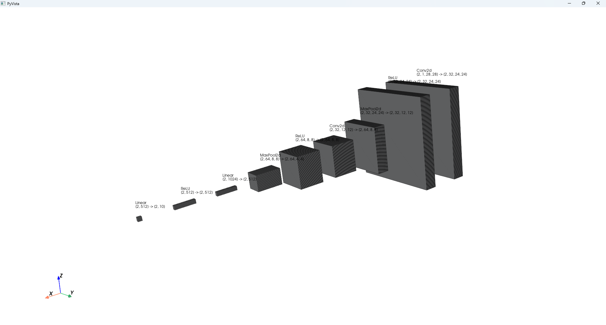

## 模型层结构可视化工具

该项目提供了一个简单的命令行工具，帮助刚刚接触深度学习的新人更好地理解和可视化深度学习模型的结构。当然，该工具仅限一些较为简单的模型，通过可视化每一层的输入、输出形状以及参数数量，用户能够直观地理解模型的构建过程。

### 项目功能

1. **加载自定义模型**：通过提供模型文件路径和模型类名称，动态加载用户自定义的深度学习模型。
2. **模型层结构总结**：展示模型的每一层，包含每层的输入输出形状、类型和参数数量。
3. **模型层可视化**：通过 `pyvista` 可视化模型的各个层，并在图形中标注每层的输入输出形状，帮助用户直观理解模型的层次结构。

### 安装依赖

本项目依赖以下 Python 库：

- `torch`：用于加载和操作深度学习模型。
- `pyvista`：用于 3D 可视化模型层次结构。
- `argparse`：命令行参数解析。

### 使用方法

在命令行中运行以下命令，传入相应参数

```
python visual.py <model_path> --model_class_name <model_class_name> --input_shape <C,H,W> --device <device>

```

- `model_path`：模型文件路径（必需）。
- `--model_class_name`：模型类名称（您的模型定义的类名称）。
- `--input_shape`：输入形状，格式为 `C,H,W`，例如 `3,224,224`（默认值是 `3,224,224`，当然您输入的形状请确保是经过测试**正确的**，否则将无法运行）。
- `--device`：使用的设备，可以是 `cpu`, `cuda` 或 `mps`（默认值是 `cuda`）。

### 示例

我在目录下放了一个 model.py 文件，用于测试，我的定义的类名称是 LeNet，且经过测试我模型应输入的正确形状为（1，28，28），并且希望在 Cuda上运行，所以我的命令如下：

```
python visual.py model.py --model_class_name LeNet --input_shape 3,28,28 --device cpu

```

运行此命令后，您会看到一个可视化后的界面，您可以使用这个进行测试并在界面中使用鼠标进行缩放移动操作。



### 说明

该工具的目的是帮助深度学习初学者更加直观地理解模型的结构和每一层的功能，尤其是对于那些刚开始接触神经网络和模型设计的用户。我想对于一个刚刚入门的初学者，所使用的模型应该不会太过于复杂，所以我在这个第一个版本并没有进行太多的设计，仅仅是完成了一个可视化的框架，这个工具此后可能会进一步优化，希望能对您有所帮助。

